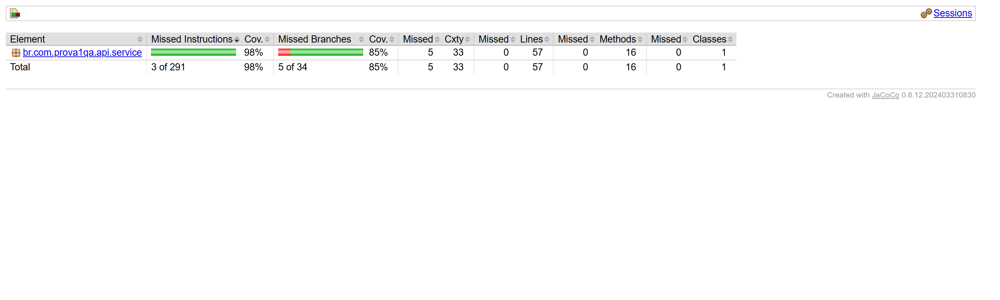
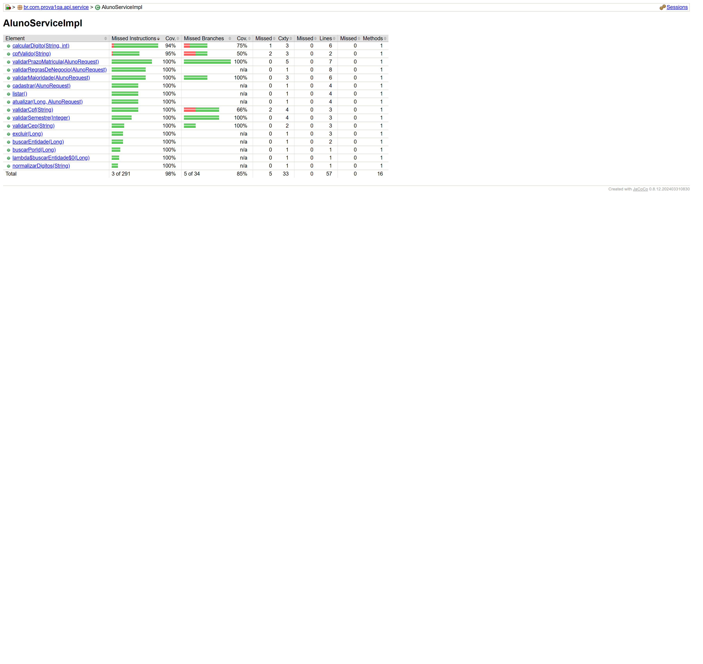
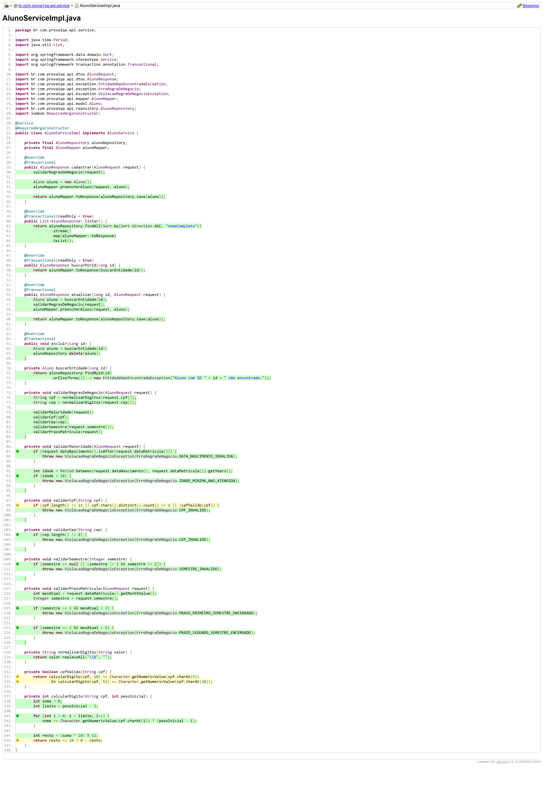

# API de Cadastro de Alunos

## Visão Geral

Aplicação desenvolvida em Spring Boot para gerenciamento de cadastro de alunos, com ênfase na implementação das regras de negócio e na sua validação por meio de testes unitários.

## Tecnologias Utilizadas

- Java 17
- Spring Boot 4
- Spring Data JPA
- Spring Validation
- PostgreSQL
- Lombok
- MapStruct
- JUnit 5
- Mockito

## Arquitetura da Aplicação

O projeto está organizado em camadas, com separação clara de responsabilidades.

- `controller`: exposição dos endpoints HTTP
- `service`: aplicação das regras de negócio
- `repository`: persistência de dados
- `model`: representação da entidade de domínio `Aluno`
- `dtos`: contratos de entrada e saída da API
- `mapper`: conversão entre DTOs e entidade
- `exception`: tratamento padronizado de erros

## Modelo de Domínio

A entidade `Aluno` contempla os seguintes atributos:

- `nomeCompleto`
- `cpf`
- `cep`
- `dataNascimento`
- `dataMatricula`
- `semestre`

## Execução do Projeto

### Inicializar o banco de dados com Docker

```powershell
docker compose up -d
```

### Executar a aplicação

```powershell
.\mvnw.cmd spring-boot:run
```

## Execução dos Testes

### Executar toda a suíte de testes unitários

```powershell
.\mvnw.cmd test
```

### Executar apenas a classe principal de testes da prova

```powershell
.\mvnw.cmd -Dtest=AlunoServiceImplTest test
```

## Cobertura de Testes com JaCoCo

O relatório de cobertura foi gerado com JaCoCo, considerando o escopo da prova focado em testes unitários da camada de serviço.

### Gerar o relatório

```powershell
.\mvnw.cmd clean verify
```

### Localização do relatório HTML

```text
target/site/jacoco/index.html
```

### Resumo da cobertura gerada

- Cobertura de instruções: `98%`
- Cobertura de desvios: `85%`
- Cobertura de linhas: `57/57`
- Cobertura de métodos: `16/16`
- Cobertura de classes: `1/1`

### Evidências do relatório

#### Visão geral do relatório



#### Detalhamento da classe avaliada



#### Cobertura por linha do código-fonte



## Estratégia de Testes

Para atender ao escopo da avaliação, o projeto foi mantido exclusivamente com testes unitários.

Os testes estão concentrados em:

- `src/test/java/br/com/prova1qa/api/aluno/AlunoServiceImplTest.java`

A classe valida a camada de serviço de forma isolada, utilizando mocks para as dependências externas e sem inicialização do contexto Spring.

## Regras de Negócio Testadas

As regras abaixo estão cobertas por testes unitários e podem ser verificadas diretamente na classe `AlunoServiceImplTest`.

| Regra de negócio | Resultado esperado | Teste associado |
| --- | --- | --- |
| A data de nascimento não pode ser posterior à data da matrícula | Deve lançar a exceção `DATA_NASCIMENTO_INVALIDA` | `deveLancarExcecaoQuandoDataNascimentoForDepoisDaMatricula` |
| O aluno deve ter, no mínimo, 18 anos na data da matrícula | Deve lançar a exceção `IDADE_MINIMA_NAO_ATENDIDA` | `deveLancarExcecaoQuandoAlunoForMenorDeIdade` |
| O CPF informado deve ser válido | Deve lançar a exceção `CPF_INVALIDO` para documento inválido | `deveLancarExcecaoQuandoCpfForInvalido` |
| O CEP informado deve ser válido | Deve lançar a exceção `CEP_INVALIDO` para CEP inválido | `deveLancarExcecaoQuandoCepForInvalido` |
| O semestre deve aceitar apenas os valores `1` ou `2` | Deve lançar a exceção `SEMESTRE_INVALIDO` para valor inválido ou nulo | `deveLancarExcecaoQuandoSemestreForInvalido` e `deveLancarExcecaoQuandoSemestreForNulo` |
| Matrículas do primeiro semestre devem ocorrer até março | Deve lançar a exceção `PRAZO_PRIMEIRO_SEMESTRE_ENCERRADO` | `deveLancarExcecaoQuandoPrimeiroSemestreEstiverForaDoPrazo` |
| Matrículas do segundo semestre devem ocorrer até setembro | Deve lançar a exceção `PRAZO_SEGUNDO_SEMESTRE_ENCERRADO` | `deveLancarExcecaoQuandoSegundoSemestreEstiverForaDoPrazo` |

### Casos de Fronteira Cobertos

- Cadastro permitido para aluno com exatamente 18 anos
- Cadastro permitido para matrícula do primeiro semestre realizada em março
- Cadastro permitido para matrícula do segundo semestre realizada em setembro

## Fluxos da Camada de Serviço Validados

Além das regras de negócio, os testes unitários também cobrem os principais comportamentos da camada de serviço:

- cadastro com dados válidos
- listagem com ordenação por nome completo
- consulta por identificador
- atualização cadastral
- exclusão de registro
- tratamento de entidade não encontrada em consulta, atualização e exclusão
